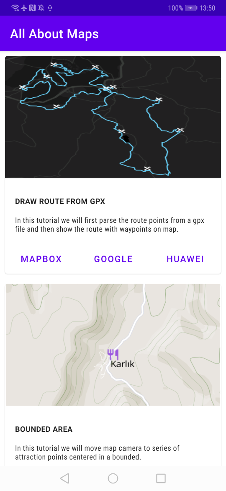
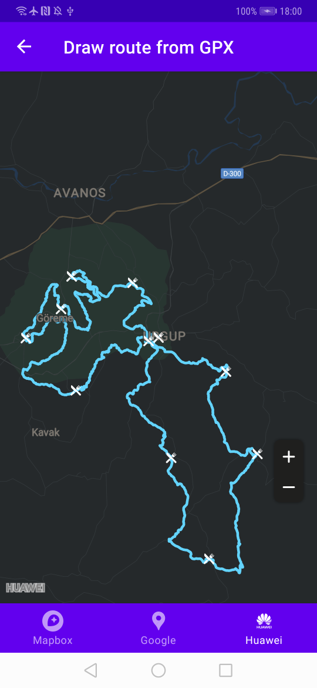

<h1 align="center">Welcome to AllAboutMaps 👋</h1>

  
  

Let's talk about maps. I started an open source project called All About Maps. In this project I aim to demonstrate how we can implement the same map related use cases with different map providers in one codebase. We will use Mapbox Maps, Google Maps, and Huawei HMS Map Kit. This project uses following libraries and patterns:

* MVVM pattern with Android Jetpack Libraries
* Kotlin Coroutines for asynchronous operations
* Dagger2 Dependency Injection
* Android Clean Architecture

## Motivation

Why do we need maps in our apps? What are the features a developer would expect from a map SDK? Let's try to list some:
* Showing a coordinate on a map with camera options (zoom, tilt, latitude, longitude, bearing)
* Adding symbols, photos, polylines, polygons to map
* Handle user gestures (click, pinch, move events)
* Showing maps with different map styles (Outdoor, Hybrid, Satallite, Winter, Dark etc.)
* Data visualization (heatmaps, charts, clusters, time-lapse effect)
* Offline map visualization (providing map tiles without network connectivity)
* Generate snapshot image of a bounded region

We can probably add more items but I believe this is the list of features which all map provider companies would most likely provide. Knowing that we can achieve the same tasks with different map providers, we should not create huge dependencies to any specific provider in our codebase. When a product owner (PO) tells to developers to switch from Google Maps to Mapbox Maps, or Huawei Maps, developers should never see it as a big deal. It is software development. Business as usual.

One would probably think why a PO would want to switch from one map provider to another. In many cases, the reason is not the technical details. For example, Google Play Services may not be available in some devices or regions like China. Another case is when a company X which has a subscription to Mapbox, acquires company Y which uses Google Maps. In this case the transition to one provider is more efficient. Change in the terms of services, and pricing might be other motivations.

We need competition in the market! Let's switch easily when needed but how dependencies make things worse? Problematic dependencies in the codebase are usually created by developing software like there is no tomorrow. It is not always developers' fault. Tight schedules, anti-refactoring minded teams, unorganized plannings may cause careless coding and then eventually to technical depts. In this project, I aim to show how we can encapsulate the import lines below belonging to three different map providers to minimum number of classes with minimum lines:

* import com.huawei.hms.maps.*
* import com.google.android.gms.maps.*
* import com.mapbox.mapboxsdk.maps.*

It should be noted that the way of achieving this is just one proposal. There are always alternative and better ways of implementations. In the end, as software developers, we should deliver our tasks time-efficiently, without over-engineering.

## Author

👤 **Cagatay Ulusoy (Ulus Oy Apps)**

* Twitter: [@ulusoyapps](https://twitter.com/ulusoyapps)
* Github: [@ulusoyca](https://github.com/ulusoyca)
* LinkedIn: [@https:\/\/www.linkedin.com\/in\/cagatayulusoy\/](https://linkedin.com/in/https:\/\/www.linkedin.com\/in\/cagatayulusoy\/)

## Show your support

Give a ⭐️ if this project helped you!

## 📝 License

Copyright © 2020 [Cagatay Ulusoy (Ulus Oy Apps)](https://github.com/ulusoyca). 
This project is [Apache License, Version 2.0 (the &#34;License&#34;)](http://www.apache.org/licenses/LICENSE-2.0) licensed.